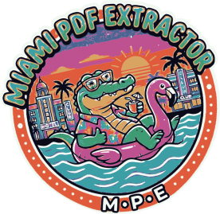

WHEN YOU HAVE TO READ DATA FROM THOUSANDS OF SIMILAR PDFs.....

  

🌴 MIAMI PDF Extractor (M.P.E) - TA feasible solution for batch PDF data extraction. 

Install easily in Linux: Appimage single file available in releases https://github.com/jmbaez75/miami-pdf-extractor/releases

Miami PDF Extractor (M.P.E) is a user-friendly tool designed to automate the extraction of specific data points from large batches of PDF documents. Built with a clean UI and robust backend, it eliminates manual data entry, saving you time and reducing human error.
🚀 Key Features

    Batch Processing: Process hundreds of PDFs in seconds.

    Smart Mapping: Dynamically map PDF layouts without complex coding.

    Automated Cleaning: Built-in filter system to sanitize and format data on the fly.

    Error Resilience: Real-time feedback and detailed error handling to ensure data integrity.

    Responsive Web Interface: A sleek, intuitive dashboard to manage your workflows.

🛠 Tech Stack

    Backend: Python (Django 6.0)

    Frontend: HTML5, CSS3, JavaScript

    Data Handling: JSON, CSV, Pandas

📋 How it Works

    Map Execution: Scan a sample PDF to generate your coordinate reference map.

    Output Columns: Easily configure which data fields you want to extract.

    Filters: Apply rules to clean your text (e.g., currency formatting, removing symbols).

    Execute Batch: Let the tool do the heavy lifting while you monitor the progress.

📸 Preview

(Insert your screenshots here)
📦 Installation & Setup

    Clone the repository:
    Bash

    git clone https://github.com/tu-usuario/miami-pdf-extractor.git
    cd miami-pdf-extractor

    Install dependencies:
    Bash

    pip install -r requirements.txt

    Run the application:
    Bash

    python manage.py runserver

🤝 Contributing

Contributions are welcome! If you have suggestions or find bugs, please feel free to open an issue or submit a pull request.

Built with love for the digital nomad life. 🐊
